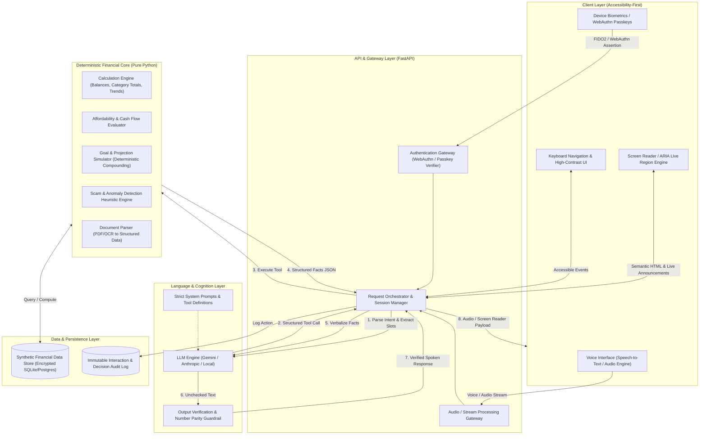
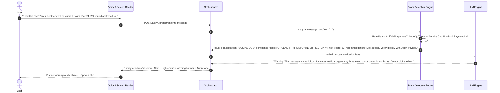

# FinSight — System Architecture Specification
**Accessibility-First, Voice-First Financial Copilot for Blind and Visually Impaired Users**

---

## 1. Executive Summary & Vision

**FinSight** is an accessibility-first, voice-first financial copilot designed to empower blind and visually impaired individuals to independently manage their finances, understand transactions and documents, detect potential scams, and make informed financial decisions with confidence.

### The Four Core Pillars

```
+-------------------------------------------------------------------------+
|                                 FINSIGHT                                |
+--------------------+--------------------+--------------------+----------+
|      1. ACCESS     |   2. UNDERSTAND    |     3. PROTECT     | 4. DECIDE|
| Voice-First UI     | Natural Language   | Scam & Anomaly     | Decision |
| Screen-Reader Core | Document Insights  | Risk Warnings      | Support  |
| Zero-Visual Need   | Spoken Facts       | Clear Distinctions | Goals    |
+--------------------+--------------------+--------------------+----------+
```

1. **ACCESS**: Voice-first primary interface, ARIA-first UI, full screen-reader parity, keyboard-only navigation, and high-contrast large controls as secondary aids.
2. **UNDERSTAND**: Conversational financial intelligence explaining spending, transaction patterns, and uploaded documents with zero reliance on charts or visual indicators.
3. **PROTECT**: Heuristic and rule-based scam detection, suspicious pattern alerts, explicit risk warnings before sensitive actions, with strict separation between "suspicious" flags and "confirmed fraud".
4. **DECIDE**: Deterministic affordability checks, savings-goal projections, recurring bill awareness, and proactive financial coaching.

---

## 2. Non-Negotiable Architectural Rules & Boundaries

### 2.1 The Cardinal Rule: Absolute Separation of Math and Language

```
+-------------------+       User Request        +-----------------------+
|                   | ------------------------> |                       |
|                   |                           |      LLM Agent        |
|                   | <------------------------ |  (Parser & Formatter) |
|                   |     Natural Response      +-----------------------+
|       User        |                                       |
|  (Voice / Assist) |                                       | Tool Call (Intent + Params)
|                   |                                       v
|                   |                           +-----------------------+
|                   |                           | Deterministic Engine  |
|                   |                           |       (Python)        |
|                   |                           +-----------------------+
|                   |                                       |
|                   |                                       | Direct Query / Compute
|                   |                                       v
|                   |                           +-----------------------+
|                   |                           |   Database & Data     |
+-------------------+                           +-----------------------+
```

1. **The LLM MUST NEVER perform financial calculations.**
   - The LLM is strictly prohibited from computing balances, sums, differences, category totals, percentage changes, projections, affordability metrics, interest, or dates.
   - All computation belongs exclusively to the **Deterministic Python Financial Engine**.

2. **The LLM MUST NEVER query the database directly.**
   - The LLM has zero direct database connections, SQL access, or raw datastore credentials.
   - Data access is mediated entirely through typed deterministic tool functions.

3. **Strict 3-Step LLM Workflow**:
   - **Step 1 (Intent & Parameter Extraction)**: Convert natural speech into a structured tool invocation (e.g., `check_affordability(amount=5000, category="electronics")`).
   - **Step 2 (Deterministic Execution)**: Python backend executes calculations, enforces rules, and queries synthetic financial records.
   - **Step 3 (Natural Language Synthesis)**: The LLM receives structured facts (JSON) and translates them into an accessible, clear, spoken response without altering or adding numbers.

---

## 3. High-Level System Architecture



---

## 4. System Components

### 4.1 Client Layer (Accessibility-First)
- **Voice Interface**:
  - Web Speech API / native mic stream with low-latency client-side Voice Activity Detection (VAD).
  - Spoken confirmation prompts for every state-changing or critical financial action.
- **Screen Reader Parity Engine**:
  - Structured semantic HTML landmarks (`<main>`, `<nav>`, `<section aria-labelledby="...">`).
  - Dedicated `aria-live="assertive"` regions for immediate announcements (e.g., scam alerts, critical balance warnings) and `aria-live="polite"` regions for standard conversational replies.
  - Zero reliance on visual cues: no standalone icons, no uncaptioned color indicators, no chart canvas elements without full textual tables/narratives.
- **Keyboard Navigation & High-Contrast Controls**:
  - Comprehensive focus management, logical tab order, skip links, and single-key shortcut access (e.g., Space to talk, 'R' to repeat last message, 'S' to silence audio).
  - WCAG AAA compliant contrast ratios (minimum 7:1) with scalable rem-based typography.
- **Device Biometrics / Passkeys (WebAuthn)**:
  - Hardware-backed biometric authentication (Touch ID, Face ID, Windows Hello, Android Biometrics).

### 4.2 API & Gateway Layer (Python / FastAPI)
- **Authentication Gateway**:
  - FIDO2 / WebAuthn server handling passkey challenge creation and cryptographic assertion verification.
  - Session manager with accessible token renewal.
- **Audio & Conversational Orchestrator**:
  - Manages real-time dialog state, turn-taking, tool dispatch, and confirmation loops.
  - Rate limiting, PII masking, and contextual memory management.

### 4.3 Deterministic Financial Engine (Pure Python)
The financial brain of the application. Contains **zero stochastic models**.
- **`CalculationEngine`**:
  - Exact decimal arithmetic (`decimal.Decimal`) for balance inquiries, spending totals, date-range filtering, and percentage changes.
- **`AffordabilityEngine`**:
  - Calculates discretionary cash flow = $(\text{Income} - \text{Fixed Bills} - \text{Committed Savings}) - \text{Current Month Spend}$.
  - Evaluates purchase risk vs. upcoming commitments within 7/14/30-day horizons.
- **`ProjectionEngine`**:
  - Deterministic compound savings formulas, goal trajectory modeling, and date-to-goal calculations.
- **`ScamDetectionEngine`**:
  - Rule-based analysis: detects urgency language in payment requests, suspicious vendor patterns, duplicate charges, sudden velocity spikes, and unverified payee details.
  - Categorizes findings into `SAFE`, `SUSPICIOUS`, or `HIGH_RISK_WARNING`.
- **`DocumentExtractionEngine`**:
  - Extracts key-value pairs from receipts, invoices, and bank statements into strict JSON schemas.

### 4.4 Intelligence Layer (LLM Boundary)
- **Role**: Natural language translation and function dispatch.
- **Guardrail Layer (`OutputGuardrail`)**:
  - Validates that every numeric value in the final LLM text strictly matches the structured facts output by the deterministic engine.
  - If a mismatch or hallucination is detected, falls back immediately to a templated deterministic response string.

### 4.5 Data Layer (Synthetic Data)
- **Synthetic Financial Dataset**:
  - Realistic mock checking, savings, credit cards, transaction histories (with synthetic scam edge cases), and recurring bills.
  - No connections to real-world banks or live financial networks.

---

## 5. End-to-End Data Flows

### 5.1 Voice Query Flow: Affordability Check
*Example: User asks: "Can I afford a ₹5,000 purchase on electronics today?"*

```mermaid
sequenceDiagram
    autonumber
    actor User as Blind User
    participant VUI as Voice / ARIA Client
    participant ORCH as API Orchestrator
    participant LLM as LLM Engine
    participant DET as Python Financial Engine
    participant DB as Synthetic Financial DB

    User->>VUI: "Can I afford a ₹5,000 purchase on electronics today?"
    VUI->>ORCH: POST /api/v1/voice/query (Transcript / Audio)
    ORCH->>LLM: Tool-calling prompt with user message
    LLM-->>ORCH: Tool Call: check_affordability(amount=5000, category="electronics")
    ORCH->>DET: execute(check_affordability, amount=5000, category="electronics")
    DET->>DB: Query current balance, recurring bills (next 30d), budget limit
    DB-->>DET: Balance: ₹24,500; Bills due: ₹12,000; Electronics budget left: ₹2,000
    DET->>DET: Compute: Remaining after bills = ₹12,500. Exceeds category budget by ₹3,000.
    DET-->>ORCH: Facts JSON: { affordable: true, risk_level: "MODERATE", remaining_discretionary: 7500, category_budget_exceeded_by: 3000, upcoming_bills_total: 12000 }
    ORCH->>LLM: Verbalize Facts JSON with strict rule: Use only provided numbers
    LLM-->>ORCH: "You have ₹24,500 in your account. You have ₹12,000 in upcoming bills, leaving ₹7,500 in discretionary funds. While you can afford ₹5,000, it will exceed your electronics budget by ₹3,000."
    ORCH->>ORCH: OutputGuardrail checks numbers match facts JSON
    ORCH-->>VUI: Audio response + aria-live text update
    VUI-->>User: Spoken voice playback + Screen reader announcement
```

### 5.2 Protection & Scam Warning Flow
*Example: User asks to analyze a suspicious payment SMS / invoice.*



---

## 6. Authentication Strategy (Accessible & Non-Visual)

Traditional authentication (complex visual CAPTCHAs, drag-to-align puzzles, visual OTP graphics, tiny login forms) creates severe barriers for blind users. FinSight implements a **biometrics-first, zero-visual authentication architecture**.

```
+-------------------------------------------------------------------------+
|                       AUTHENTICATION MODES                              |
+------------------------------------+------------------------------------+
|         PRIMARY (Passkeys)         |        ACCESSIBLE FALLBACK         |
|  - WebAuthn / FIDO2 Standard       |  - Time-based OTP (Autofill/Voice) |
|  - Touch ID / Face ID / Hello      |  - Cryptographic Device Attestation|
|  - No passwords to remember/type   |  - Audio CAPTCHA (WCAG compliant)  |
|  - One-touch / single-keypress auth|  - Zero visual-only verification   |
+------------------------------------+------------------------------------+
```

### 6.1 Core Authentication Principles
1. **Device Biometrics / Passkeys (Primary)**:
   - Built on WebAuthn / FIDO2.
   - User authenticates using their device’s native biometrics (Fingerprint, Touch ID, Face ID, or Windows Hello) triggered by a single accessible button or keyboard shortcut.
   - Eliminates password typing errors, visually hidden character masks, and password management friction.

2. **Accessible Fallback Strategy**:
   - When biometrics are unavailable (e.g., older hardware or unsupported browsers):
     - **Accessible OTP**: Numeric token via standard SMS/Email with standard `autocomplete="one-time-code"` for immediate screen-reader auto-fill and spoken entry.
     - **WCAG-Compliant Audio Challenges**: If bot verification is strictly required, exclusively use clear, audio-first cryptographic challenges (never visual distortion CAPTCHAs or image-selection grids).

3. **Role of Voice in Authentication**:
   - **Voice is the interaction interface, not the sole authentication factor.**
   - Voice biometrics alone are not used as single-factor authentication due to replay and synthetic voice risks. Voice commands initiate actions, but critical financial actions are authorized via device biometric confirmation or explicit spoken two-factor challenge.

---

## 7. Accessibility Principles & Specifications

FinSight is built to adhere to **WCAG 2.2 Level AAA** for non-visual and cognitive accessibility:

| Accessibility Dimension | Architectural Specification | Implementation Rule |
| :--- | :--- | :--- |
| **Non-Visual Information Parity** | Every visual metric has an identical spoken and text representation. | Never render a chart without an accompanying natural-language synthesis and a screen-reader data table. |
| **Spoken Confirmations** | Destructive or high-impact actions require two-step verbal confirmation. | Action is staged in `PENDING_CONFIRMATION` until the user speaks "Confirm" or presses the primary action key. |
| **Screen Reader Architecture** | Full semantic hierarchy with live regions. | Use `aria-live="polite"` for conversational answers, `aria-live="assertive"` for security alerts. |
| **Keyboard Navigation** | Complete single-key and logical tab navigation. | All features accessible via keyboard alone. Global shortcut keys with spoken help (`?`). |
| **High Contrast & Typography** | Secondary aid for low-vision users. | Minimum 7:1 contrast ratio, support for 200%+ zoom without horizontal scroll, dark/light high-contrast themes. |
| **Error Handling & Feedback** | Clear, actionable spoken error descriptions. | Avoid generic error codes ("Error 500"). Announce the exact cause and clear recovery steps in plain language. |

---

## 8. Security, Privacy & Guardrail Principles

1. **Anti-Hallucination Guardrail**:
   - An interceptor verifies that every currency figure, percentage, and date in the LLM response originates verbatim from the Python Financial Engine output.
   - Hallucination detection triggers an automatic rollback to deterministic sentence templates.

2. **Scam Detection Distinction**:
   - The engine explicitly differentiates between:
     - **`SUSPICIOUS_ANOMALY`**: Uncharacteristic pattern, new payee, or slight heuristic match. (Spoken tone: Informative caution).
     - **`HIGH_RISK_WARNING`**: Strong indicators of phishing, urgent extortion, or known scam patterns. (Spoken tone: Immediate alert, action blocked pending biometric re-auth).
   - The system **never makes unsupported absolute claims** (e.g., avoids saying "This is 100% fraud guaranteed"; instead says: "This message matches common electricity bill scam patterns due to urgent 2-hour payment threats").

3. **PII Scrubbing & Synthetic Isolation**:
   - User identity tokens and sensitive account numbers are masked before sending prompt context to external LLM providers.
   - Demo/hackathon version runs on fully synthetic, realistic transaction datasets.

---

## 9. API & Interface Boundaries

### 9.1 REST & WebSocket Gateway Interfaces

#### `POST /api/v1/voice/query`
- **Description**: Handles voice transcript or audio query, executes deterministic tools, and returns spoken + ARIA payload.
- **Request**:
  ```json
  {
    "session_id": "sess_abc123",
    "query_text": "Can I afford to buy a ₹5,000 gadget?",
    "input_mode": "voice"
  }
  ```
- **Response**:
  ```json
  {
    "spoken_response": "You have ₹24,500 in your account and ₹12,000 in upcoming bills. You can afford ₹5,000, but it will exceed your monthly gadgets budget by ₹3,000.",
    "aria_live_priority": "polite",
    "structured_facts": {
      "affordable": true,
      "current_balance": 24500.00,
      "upcoming_bills": 12000.00,
      "discretionary_funds": 7500.00,
      "budget_overage": 3000.00
    },
    "requires_confirmation": false
  }
  ```

#### `POST /api/v1/documents/analyze`
- **Description**: Parses an uploaded financial document (PDF / image receipt) deterministically, extracts key facts, and provides natural-language spoken explanation.
- **Request**: `multipart/form-data` (file payload)
- **Response**:
  ```json
  {
    "document_type": "electricity_bill",
    "spoken_summary": "This is an electricity bill from BESCOM for ₹1,850, due on September 5th. It is ₹200 lower than your last month's bill.",
    "extracted_facts": {
      "vendor": "BESCOM",
      "amount": 1850.00,
      "due_date": "2026-09-05",
      "comparison_to_last_month": -200.00
    },
    "is_suspicious": false
  }
  ```

#### `POST /api/v1/protect/analyze-message`
- **Description**: Evaluates financial SMS, email, or payment requests for scam indicators.
- **Request**:
  ```json
  {
    "message_text": "URGENT: Your bank account will be blocked today. Click http://bit.ly/fake-bank to update KYC."
  }
  ```
- **Response**:
  ```json
  {
    "classification": "HIGH_RISK_WARNING",
    "risk_score": 96,
    "spoken_alert": "Urgent Warning: This message is a suspected phishing scam. Banks never threaten immediate account suspension via shortened links. Do not click.",
    "aria_live_priority": "assertive",
    "flags": ["ACCOUNT_SUSPENSION_THREAT", "SHORTENED_LINK", "UNOFFICIAL_KYC_REQUEST"]
  }
  ```

### 9.2 Deterministic Financial Engine Function Signatures (Python)

```python
# Pure deterministic python functions - zero LLM logic

def get_account_summary(user_id: str) -> dict:
    """Calculates balances, total spending, and available funds."""
    ...

def check_affordability(user_id: str, amount: Decimal, category: str) -> dict:
    """Evaluates whether user can afford purchase against bills and budgets."""
    ...

def calculate_goal_projection(user_id: str, goal_id: str, monthly_contribution: Decimal) -> dict:
    """Calculates months to reach savings target deterministically."""
    ...

def evaluate_scam_risk(text: str, sender: Optional[str] = None) -> dict:
    """Applies heuristic rule engine to classify message scam risk."""
    ...

def parse_financial_document(file_bytes: bytes, mime_type: str) -> dict:
    """Extracts structured values from statements/receipts."""
    ...
```

---

## 10. Synthetic Data Strategy

FinSight utilizes an isolated synthetic dataset to simulate realistic financial situations:
- **Diverse Transaction Streams**: Regular salaries, utility bills, groceries, transit, subscriptions, and occasional large purchases.
- **Edge Cases & Scams**: Synthetic SMS messages simulating utility fraud, phishing links, and fake refunds to test and demonstrate the Protect engine.
- **Goal Scenarios**: Emergency funds, vacation savings, and technology purchase goals with mathematical projection benchmarks.

---

## 11. Project Directory Layout

```
finsight/
├── ARCHITECTURE.md                  # This architecture specification
├── backend/
│   ├── app/
│   │   ├── api/                     # FastAPI route controllers
│   │   ├── core/                    # App config, security, WebAuthn
│   │   ├── engine/                  # Deterministic Python Financial Engine
│   │   │   ├── affordability.py     # Deterministic affordability checks
│   │   │   ├── calculations.py      # Balances, category sums, trends
│   │   │   ├── projections.py       # Savings goal projection formulas
│   │   │   ├── scam_detector.py     # Heuristic fraud & scam analyzer
│   │   │   └── document_parser.py   # Deterministic document extractor
│   │   ├── llm/                     # LLM tool definitions & synthesis prompts
│   │   │   ├── tools.py             # Function schemas exposed to LLM
│   │   │   ├── orchestrator.py      # LLM invocation & tool router
│   │   │   └── guardrails.py        # Number verification & anti-hallucination
│   │   ├── models/                  # Pydantic & SQLAlchemy data models
│   │   └── data/                    # Synthetic financial database seeds
│   └── tests/                       # Unit tests for deterministic math & guardrails
└── frontend/                        # Accessibility-first frontend
    ├── index.html                   # Semantic HTML skeleton with ARIA landmarks
    ├── src/
    │   ├── audio/                   # Web Speech API & speech synthesis controller
    │   ├── auth/                    # WebAuthn / Passkey client authentication
    │   ├── components/              # ARIA live regions, high-contrast controls
    │   └── styles/                  # High-contrast, WCAG AAA compliant CSS
    └── package.json
```
